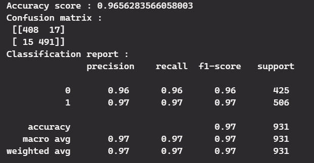

# Customer Churn Prediction for Improved Retention

## **Problem:**

Customer churn, the loss of subscribers to a service, poses a significant challenge across various industries. Acquiring new customers often incurs greater costs than retaining existing ones. This project aims to develop a machine learning model that predicts customers at risk of churning, allowing businesses to take proactive measures and maximize customer retention.

## **Significance:**

- Reduced Costs: Predicting churn enables businesses to prioritize retention efforts, saving resources on customer acquisition.
- Enhanced Customer Experience: Identifying churn-prone customers allows for tailored incentives and support, improving satisfaction and loyalty.
- Data-Driven Strategies: Churn prediction empowers businesses to make data-driven decisions regarding retention programs.

## **Project Description:**

This project leverages machine learning to predict customer churn in a telecommunications dataset. Here's an overview of the key steps:

1. Data Exploration and Analysis (EDA):
Understand the data structure, distribution of variables, and relationships between churn and other customer attributes.

2. Data Preprocessing:
Handle missing values, address inconsistencies, and prepare data for modeling.

3. Feature Engineering:
Create new features that might enhance the model's predictive power (e.g., tenure squared, total service usage).

4. Feature Selection (SelectKBest):
Identify the most informative features to improve model efficiency and avoid overfitting.

5. Model Training and Hyperparameter Tuning (RandomSearchCV):
Train and evaluate various machine learning algorithms (e.g., Random Forest, Logistic Regression) to find the best performing model.

6. Optimize hyperparameters to maximize model accuracy.

7. Model Deployment:

- Save the trained model for future use (e.g., using Pickle).
- Develop a web application using Flask to create a user-friendly interface for churn prediction.
- Deploy the application to a platform like Heroku for accessibility.

**Project Dependencies:**

Python, NumPy, Pandas, Matplotlib, Seaborn, Scikit-learn, Scipy, Imbalanced-learn, Counter, Flask

### **Run the project:**

- Download the dataset: [Telco-Customer-churn.csv](link to dataset)
- Install required packages: 
```python
pip install -r requirements.txt (assuming a requirements.txt file exists)
```

- Download project files: app.py and TelecomCustomerChurn.ipynb

- Run TelecomCustomerChurn.ipynb in a Jupyter Notebook environment to explore and build the model.

Evaluation: 
- The finalized model achieved an accuracy of 96.5% on test data.
- Gradient Boosting Classifier comes out to be the best model for this use case with the following precision and recall:

  

### Conclusion:

This customer churn prediction project offers businesses a valuable tool to optimize customer retention strategies, leading to increased revenue and customer satisfaction. By deploying the model and continuously iterating based on new data, businesses can gain a competitive edge in a dynamic marketplace.
